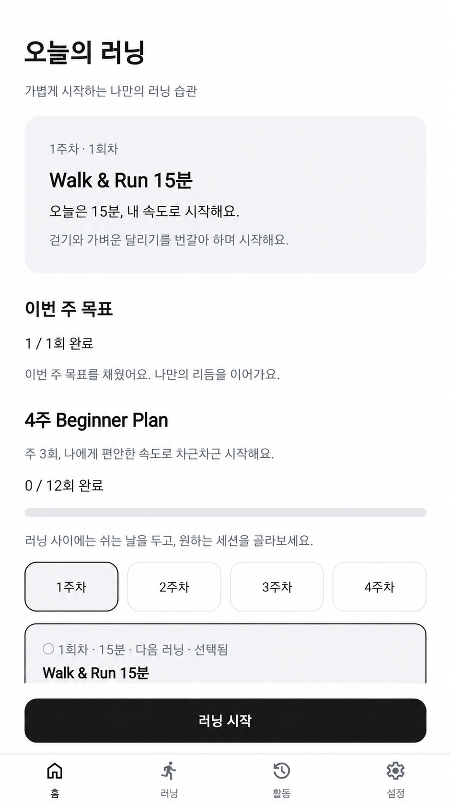
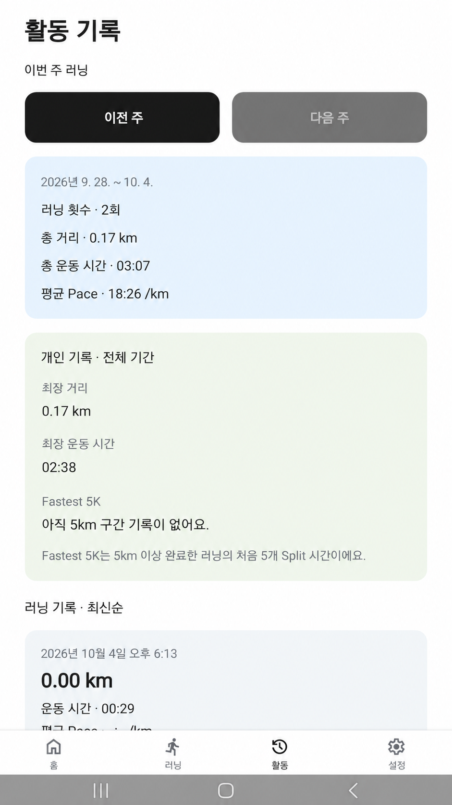

# Today's Running

초보 러너가 운동을 시작하고, GPS로 러닝을 기록하며,
자신의 성장을 확인할 수 있도록 만든 React Native 러닝 앱입니다.

로그인과 서버 없이 SQLite 기반 Local-first 구조로 구현했습니다.

이 프로젝트에서는 **AI가 만들어내는 생산성과, 실제 코드를 배포하는 개발자의 책임 사이의 균형**을 가장 많이 고민했습니다.

AI를 활용해 구현 속도를 높이면서도,
GPS 기록·Pause/Resume·Transaction·Training 진행률처럼
사용자가 신뢰해야 하는 핵심 동작을 테스트로 검증하는 데 집중했습니다.

## Preview

Android 앱에서 촬영한 홈, 활동 기록, 활동 상세 화면입니다.

| Home | Activity | Activity Detail |
| --- | --- | --- |
|  |  |  |

> 활동 상세의 지도는 위치 정보 노출을 줄이기 위해 흐림 처리된 이미지입니다.

## What I focused on

### AI가 작성한 구현을 어떻게 검증할까?

테스트 개수보다 어떤 동작을 보장하는지가 중요하다고 생각했습니다. Pause 중 시간과 이동이 러닝 기록에서 제외되는지, 저장 실패 시 GPS 좌표와 누적 거리가 함께 롤백되는지, 러닝 완료와 Training 진행률이 함께 저장되는지를 검증했습니다.

아직 코드 검토와 테스트 사이에 하나의 정답이 있다고 생각하지는 않습니다. 다만 코드를 얼마나 많이 읽었는가뿐 아니라 **배포하는 동작을 얼마나 신뢰할 수 있게 만들었는가**도 중요하다고 느꼈습니다.

### GPS 데이터는 그대로 믿을 수 없다

정확도가 낮은 좌표, 순간 이동, 비현실적인 속도, 오래된 위치 데이터가 거리 계산에 들어가지 않도록 저장 전에 검증합니다. Pause/Resume에서는 거리 계산의 기준점을 초기화해 멈춘 동안의 이동을 제외했습니다.

### Runtime 상태와 영구 데이터를 분리했다

실시간 UI 상태는 Zustand에서 관리하고, 진행 중인 러닝과 GPS 좌표를 포함한 영구 데이터는 SQLite를 기준으로 관리했습니다. 함께 저장되어야 하는 변경은 Transaction으로 처리했습니다. 진행 상태 저장과 앱 재실행 후 복구 UX는 구분하며, 복구 UX는 보완할 부분으로 남아 있습니다.

→ [구조, GPS 처리 정책과 기술 선택](./docs/architecture.md)

## Testing

자동 테스트는 AI가 작성한 구현의 동작을 확인하는 장치로 사용했습니다.

| 검증 방식 | 상태 |
| --- | --- |
| 자동 테스트 | 로직·통합 테스트 92개 통과 |
| Android 실기기 | APK 설치 후 주요 사용자 흐름 정상 동작 확인 |
| Maestro E2E | 자동화 시나리오 작성 완료, 기기 실행 확인 예정 |
| iOS 실기기 | 검증 예정 |

자동 테스트는 거리·페이스·Split·GPS 필터의 경계값과 SQLite Transaction, Run Lifecycle, Background 처리, Training 연동을 확인합니다. 최근 로컬 검증에서 **TypeScript·Lint·Expo 설정 검사**도 통과했습니다.

Android에서는 APK를 실제 기기에 설치하고 직접 조작해 주요 흐름의 정상 동작을 확인했습니다. Maestro는 같은 사용자 흐름을 자동으로 실행하는 테스트이며, 시나리오 작성까지 완료했습니다. 로직·통합 테스트에서 네이티브 API는 Mock을 사용하므로 실제 GPS·지도·화면 잠금 동작은 기기에서 별도로 확인해야 합니다.

→ [테스트 구성과 검증 범위](./docs/testing-strategy.md)

## Tech

React Native · Expo · TypeScript · Expo Router · Zustand · expo-sqlite · expo-location · expo-task-manager · react-native-maps · EAS Build · Maestro

## Run locally

```bash
npm ci
npm run web
```

웹에서는 UI와 화면 흐름을 확인할 수 있습니다. 네이티브 지도와 Background GPS는 Android/iOS Development 또는 Preview Build에서 확인해야 합니다.

```bash
npm run qa
```

`qa`의 설정 검사는 `.env`에 `GOOGLE_MAPS_ANDROID_API_KEY`가 필요합니다. 키는 Git에 커밋하지 않습니다.

→ [Node 환경, Maps 설정과 Android 빌드 방법](./docs/architecture.md#로컬-실행)

## What I would improve

- 다양한 기기와 야외 환경에서 GPS 정확도 기준을 검증하고 조정하기.
- iOS 실기기에서 권한, 화면 잠금 중 위치 기록, Apple Maps 동작 확인하기.
- 앱 재실행 시 중단된 러닝을 찾아 이어가거나 종료할 수 있는 복구 UX 추가하기.
- Maestro 시나리오의 실제 기기 실행과 시간·거리·저장 결과 검증 보완하기.

## Documents

- [Architecture · GPS 정책 · 실행 및 빌드](./docs/architecture.md)
- [Testing Strategy](./docs/testing-strategy.md)
